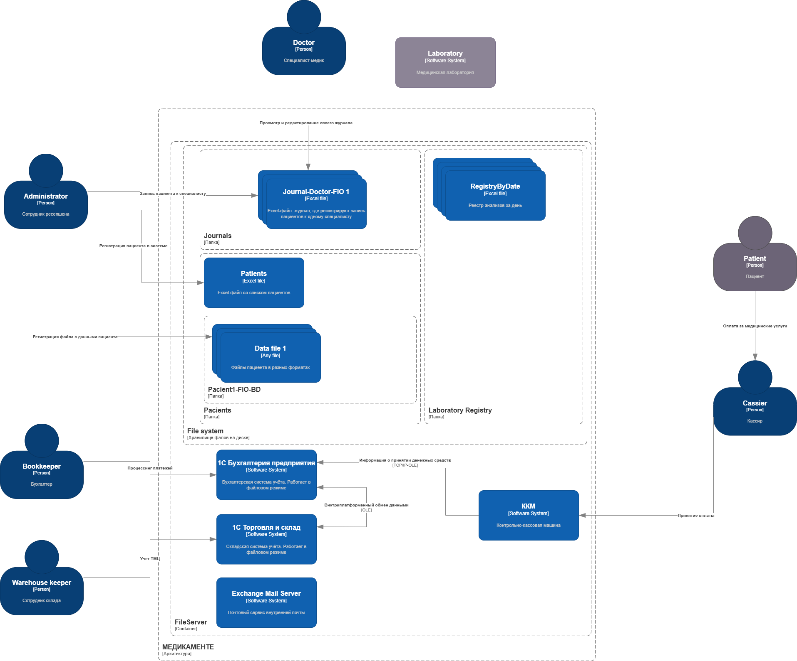
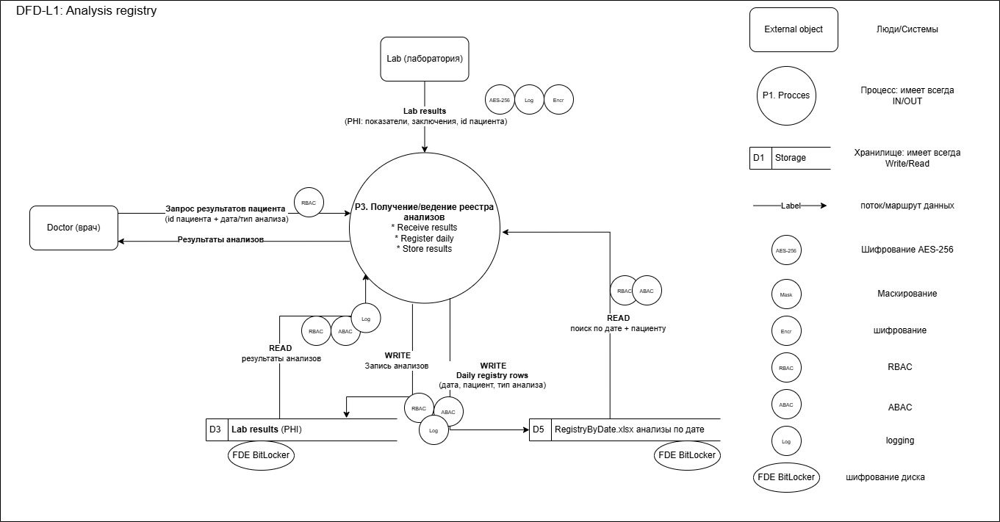
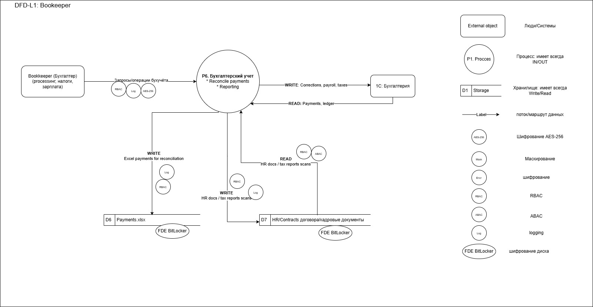
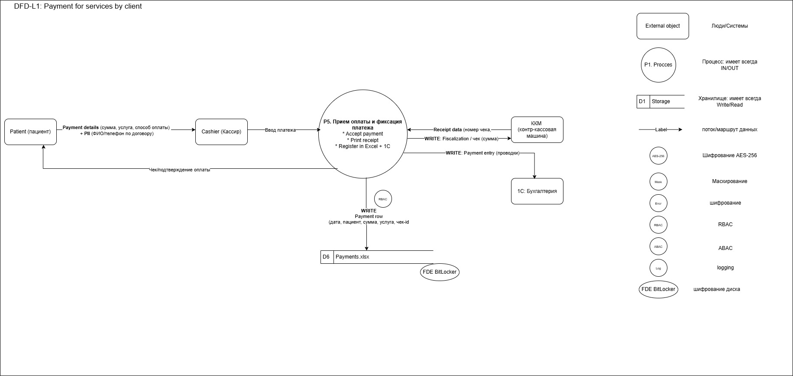
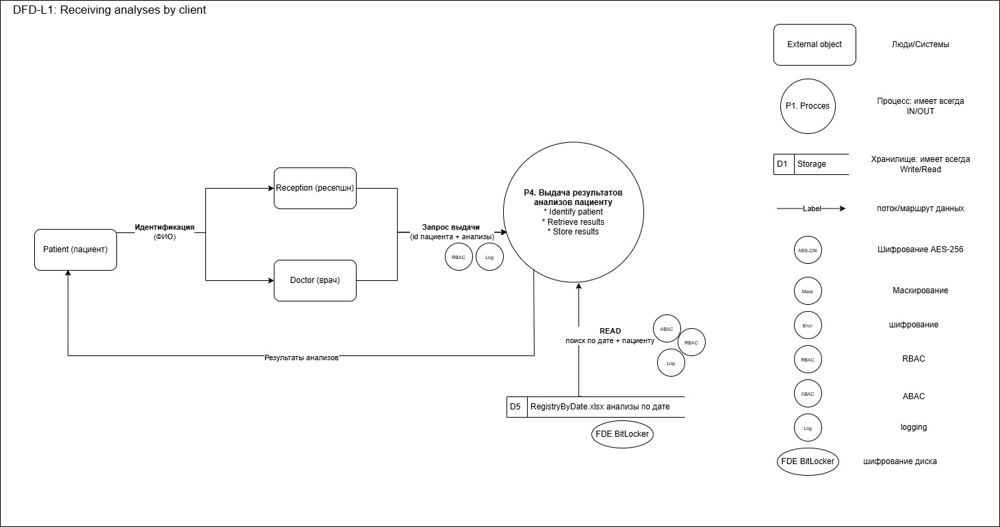
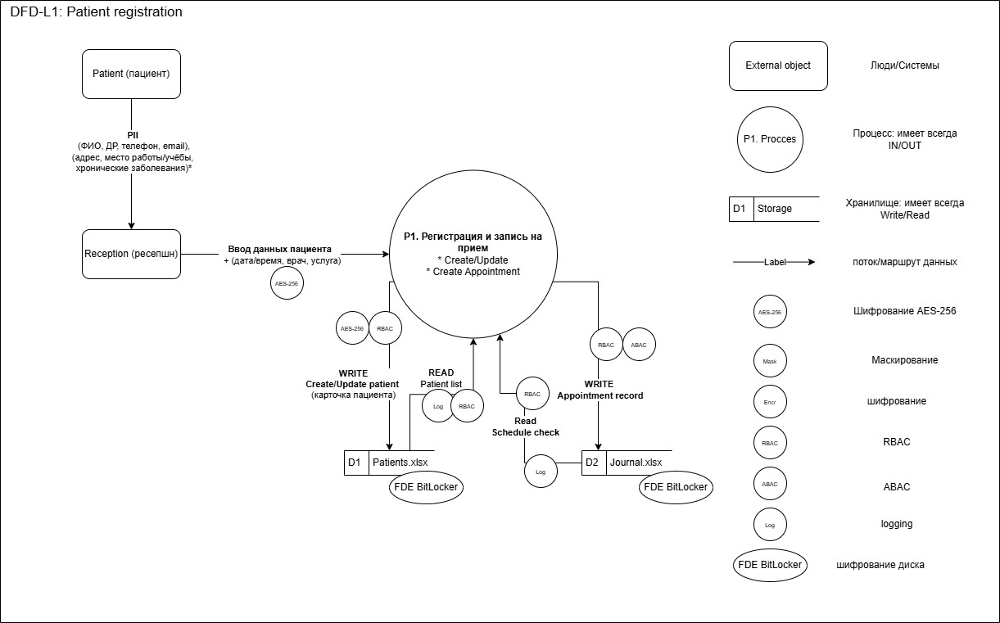
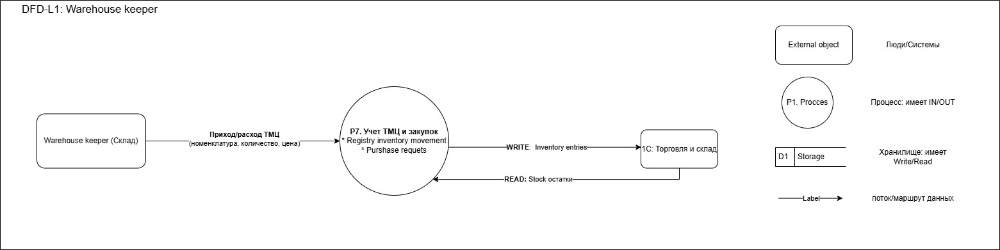
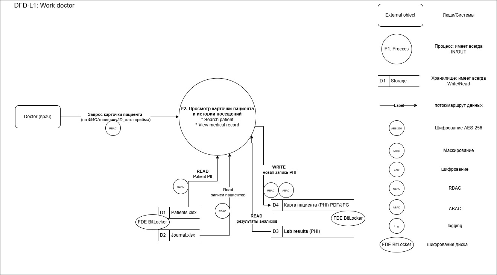

## Задание 1. Анализ безопасности системы
- Анализ информации компании
  - [README.md](../as_is/README.md)
  - 

## Диаграммы потоков данных DFD
- выбран Level 1 - наглядно для каждого процесса
  - L0 слишком абстрактно
  - L2 сейчас не требуется
  - 
  - 
  - 
  - 
  - 
  - 
  - 

## Категории данных
- [data.types.md](data.types.md)

## Список проблемных зон
- [problem-areas.md](problem-areas.md)

## список данных для защиты
|     **Тип данных**     | **Класс**  | **Способ защиты**              |
|:----------------------:|:-----------|:-------------------------------|
|          ФИО           | PII        | Шифрование AES-256             |
|        Телефон         | PII        | Маскирование + шифрование      |
|         Email          | PII        | Детерминированное маскирование |
|        Диагноз         | PHI        | Шифрование + RBAC              |
|  Результаты анализов   | PHI        | Шифрование + ABAC              |
|    История платежей    | Financial  | Шифрование + журналирование    |
|     Скан договора      | PII        | Шифрование                     |

- типы добавлены на схемах, описанных выше
  - с учетом текущей ситуации (как есть, без планов в будущем), то есть что нужно внедрить как минимум сейчас

##  Механизм тегирования данных
- TAG_PII
- TAG_PHI
- TAG_FIN
- TAG_PUBLIC
- TAG_INTERNAL
- TAG_RAW
- TAG_VERIFIED
- TAG_ANALYTICS

- Инструмент для тегирования:
  - Каталог метаданных (Apache Atlas или Collibra)
  - RBAC на основе тегов
  - Автоматический сканер PII (BigID / open source решения)

## Инструменты, которые нужно внедрить
- IAM
  - Keycloak
  - RBAC
  - ABAC

- Шифрование
  - TLS 1.3
  - AES-256
  - Disk encryption (BitLocker или LUKS)

- DLP
  - Microsoft Purview / аналоги

- Data Lineage
  - Apache Atlas

- Аудит
  - ELK stack
  - SIEM

- Мониторинг
  - Prometheus → метрики инфраструктуры