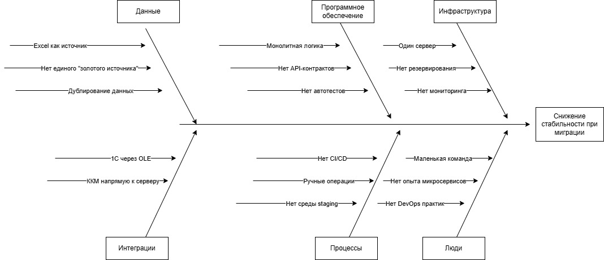

## Оценка узких мест при миграции

### Анализ ситуации
- при текущей ситуации компания переходит не от монолита, а от
  - Excel + файлового сервера
  - 1С в файловом режиме
  - ручных процессов
- к новым компонентам
  - CRM Core
  - порталам
  - микросервисам
  - Data Lake
  - централизованной безопасности
- риски 
  - в процессе миграции система может быть нестабильной
  - данные могут быть потеряны

### Диаграмма Исикавы
- 
- [Isikava_FISH.drawio](Isikava_FISH.drawio)

### Основные категории и возможные проблемы
- Инфраструктура
  - проблемы
    - Один физический сервер
    - Нет резервирования
    - Нет кластеризации БД
    - Ограниченные ресурсы CPU / RAM
    - Нет централизованного мониторинга
  - риски
    - падение системы при росте нагрузки
    - долгий RTO - время восстановления

- Программное обеспечение
  - проблемы
    - Монолитная логика
    - Жёсткие зависимости
    - Нет API-контрактов
    - Нет версионирования
    - Нет автотестов
  - риски
    - ошибки при переносе логики
    - регрессии
    - рост MTTR

- Данные
  - проблемы
    - Excel как источник правды
    - Нет единого "золотого источника"
    - Нет Data Lineage
    - Дублирование данных
    - Нет контроля качества данных
  - риски
    - потеря данных
    - несогласованность
    - ошибки миграции
-
- Интеграции
  - проблемы
    - 1С через OLE
    - ККМ напрямую к серверу
    - Лаборатория через будущий API
  - риски
    - несовместимость
    - нестабильность интеграции
    - проблемы с синхронизацией

- Процессы
  - проблемы
    - Ручные операции
    - Нет CI/CD
    - Нет feature toggle
    - Нет среды staging
  - Риски
    - сложные релизы
    - высокий lead time
    - ошибки в продакшене

- Люди
  - проблемы
    - Маленькая команда
    - Нет опыта микросервисов
    - Нет DevOps практик
    - Зависимость от одного технического директора
  - риски
    - узкое место в принятии решений
    - перегруз ключевых сотрудников

### Рекомендации
- Высокий приоритет
  - Внедрить мониторинг (Prometheus + SIEM)
  - Вынести БД CRM в отдельный сервер
  - Сделать staging-среду
  - Добавить автоматический бэкап + тест восстановления
  - Ввести CI/CD
- Средний приоритет
  - Описать API-контракты
  - Разделить домены данных
  - Ввести feature toggles
  - Построить Data Migration план
- Низкий приоритет
  - Полная контейнеризация
  - Kubernetes
  - Расширенная аналитика

| Мера             | Приоритет | Комментарий                   |
|------------------|-----------|-------------------------------|
| Мониторинг       | Высокий   | Без него не увидим проблемы   |
| Бэкапы + RTO/RPO | Высокий   | Риск потери данных            |
| CI/CD            | Высокий   | Снизит ошибки релизов         |
| API-контракты    | Средний   | Уменьшит интеграционные риски |
| Контейнеризация  | Низкий    | Можно внедрить позже          |

- Главный риск — данные и инфраструктура
- Второстепенный риски — процессы и команда, интеграции
