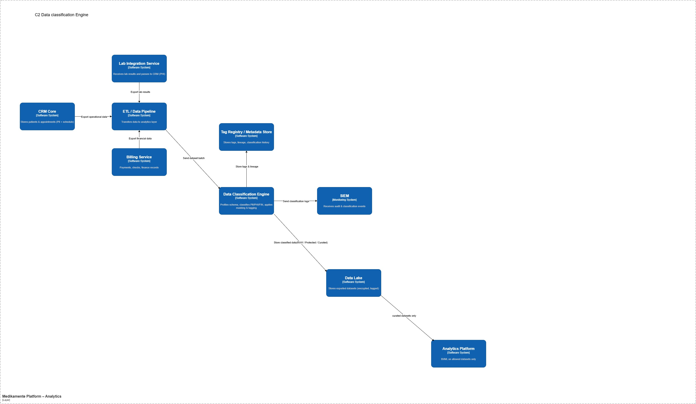

## Классификация данных

### Вводные
- цель
  - обработка данных перед загрузкой в аналитическое хранилище
    - определить какие данные конфиденциальные
    - автоматически присвоить теги (PII/PHI/FIN)
    - маскирование или псевдонимизацию
  - недопущение утечки чувствительных данных в аналитику
- данные могут быть
  - неразмеченные
  - разная структура
  - разные источники
- проблемы
  - PII и PHI могут попасть в аналитику без контроля
  - отсутствие авто-классификации
    

## Архитектура
- данные поступают из CRM/Billing/Lab 
- используем процесс ETL - тобиш обрабатываем перед загрузкой
- классификация в Data Classification Engine
- запись данных в озеро - сырые, размеченные, золотой источник
- отправка в аналитику

- Основные компоненты 
  - Data Ingestion Adapter
    - принимает данные из ETL
    - поддерживаемые типы данных: JSON/CSV/ SQL dump
    - логирование
  - Schema Profiler
    - анализ структуры
    - определение
      - тип данных
      - названия колонок, полей
    - фиксация изменений структуры
  - Classification Engine
    - классификация на основе политик:
      - правила `regex` для телефона, email, паспорта, номер банковской карты
      - словарь медицинских терминов
      - шаблоны - дни рождения, адрес
    - присваивает теги
      - TAG_PII
      - TAG_PHI
      - TAG_FIN
      - TAG_PUBLIC
      - TAG_INTERNAL
      - TAG_RAW
      - TAG_VERIFIED
      - TAG_ANALYTICS
  - Policy Processor
    - работа с тегированными данными
      - TAG_PII - маскирование
      - TAG_PHI - псевдонимизация
      - блокировать если запрещено
  - Tag Registry (Metadata Store)
    - список тегов
    - историю изменений
    - Data Lineage
    - связь поле + тег
  - Audit & Metrics Collector
    - логирует решения классификатора
    - считает ошибки
    - отправляет события в SIEM

- Структура Data Lake
  - RAW Zone
    - в исходном виде
    - шифрование
    - не доступны для аналитики
  - Protected Zone
    - данные классифицированны
    - маскированны
    - доступны через строгие политики
  - Curated
    - данные досутпные для аналитики
    - очищенные PII/PHI 

## Схэма С2 контейнера Data Classification Engine
- [C2_data-classification.diagram.drawio](C2_data-classification.diagram.drawio)
- 

### Метрики для эффективной классификации
- Точность
  - Precision - сколько найденных PII действительно PII
  - Recall - сколько реальных PII система обнаружила
- Ошибки
  - Ложноположительные
  - Ложноотрицательные - самые опасные
- Производительность
  - время обработки набора
  - нагрузка CPU
- Качество
  - процент необработанных данных

### Масштабируемость
- Горизонтальное
  - классификатор работает как stateless сервис
  - масштабируется через Kubernetes
- разделение нагрузки
  - каждый процесс отдельно
    - профилирование/класиффикация/маскирование
- асинхронная обработка
  - очередь (Kafka)

### PrivacyByDesign
- Конфиденциальность по умолчанию
  - данные не попадают в аналитику без проверки
- Минимизация данных
  - в Curated зоне только разрешённые поля
- End-to-End защита
  - шифрование RAW, контроль тегов, аудит
- Data Lineage
  - Tag Registry фиксирует путь данных

### Риски

| Риск                | Решение                        |
|---------------------|--------------------------------|
| Пропуск PHI         | регулярное обновление правил   |
| Ложные срабатывания | улучшение профилирования       |
| Рост объёма данных  | горизонтальное масштабирование |
| Изменение схемы     | Schema Profiler                |

## В результате
- новый слой Data Classification Engine
  - авто-классификация данных
  - политики защиты
  - недопущение утечки чувствительных данных
  - масштабируемость